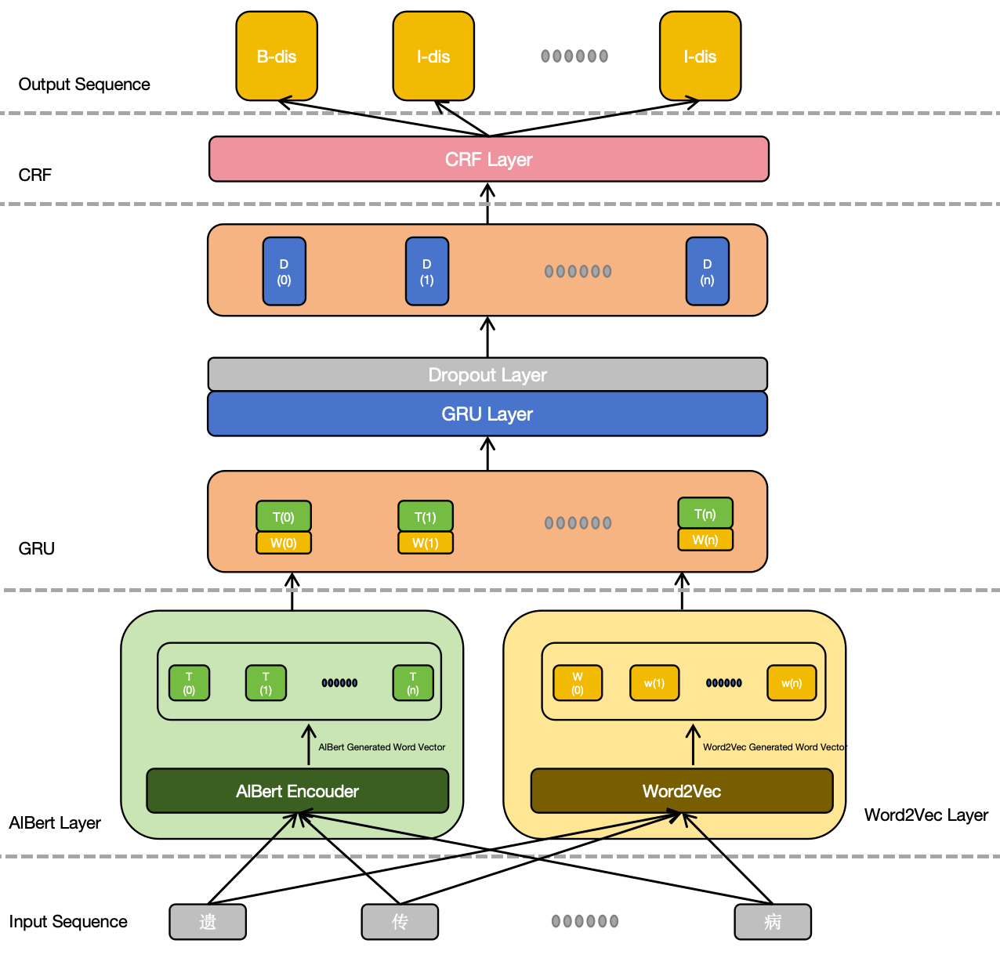

AlBertGRUCrf

To improve the efficiency and accuracy of Chinese medical text Named Entity Recognition (NER), we reviewed a large number of studies and conducted an analysis and pre-evaluation of existing models and methods. 
Considering the characteristics of Chinese medical texts, we proposed a novel model, AlBert-GRU-CRF. This model combines AlBert and Word2Vec vectors using an attention mechanism, passes the results through a bidirectional GRU layer, and then feeds them into the CRF.

## Figure 1
Here is a figure of the model structure:

